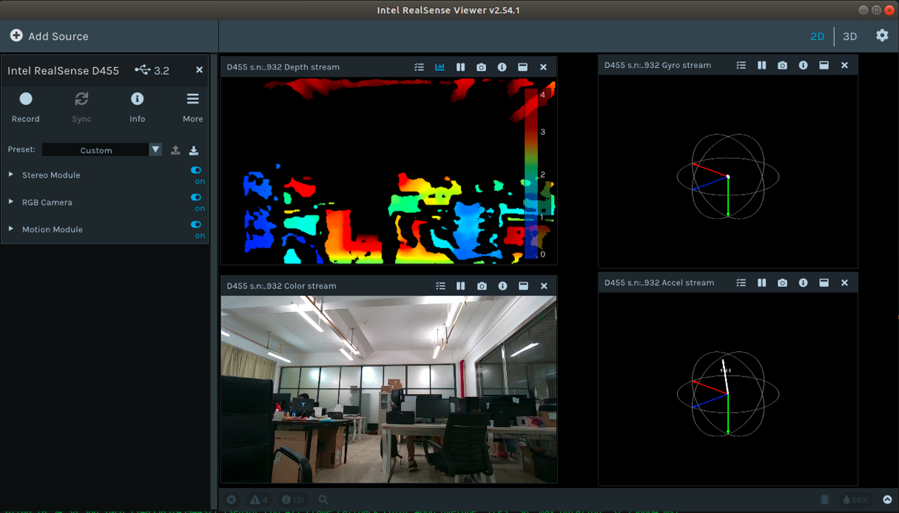

# Ubuntu下使用Intel® RealSense™ D455

> 本教程基于**Ubuntu 18.04**

1. 更新Ubuntu（**此时先不要将RealSense D455与Ubuntu连接**）

    ```bash
    sudo apt-get update && sudo apt-get upgrade && sudo apt-get dist-upgrade
    ```

2. 下载最新的librealsense SDK

    ```bash
    git clone https://ghproxy.com/https://github.com/IntelRealSense/librealsense.git
    ```

3. 安装必要的依赖

    ```bash
    cd ~/librealsense
    sudo apt-get install git libssl-dev libusb-1.0-0-dev pkg-config libgtk-3-dev 
    sudo apt-get install libglfw3-dev
    ```

4. 安装librealsense原文件目录下的许可脚本

    ```bash
    cd ~/librealsense
    sudo cp config/99-realsense-libusb.rules /etc/udev/rules.d/ 
    sudo udevadm control --reload-rules && udevadm trigger
    ```

5. 编译librealsense

    ```bash
    cd ~/librealsense
    mkdir build && cd build
    cmake ../
    cmake ../ -DBUILD_EXAMPLES=true
    ```

6. 安装librealsense-SDK

    ```bash
    sudo make uninstall && make clean && make && sudo make install
    ```

7. 连接相机至电脑USB3.0接口并打开摄像头显示界面

    ```bash
    realsense-viewer
    ```

效果如图所示：


> 如图所示，一共三个模块：

- 深度模块 (Stereo Module)
- RGB摄影机 (RGB Camera)
- 动作感测模块 (Motion Module)
